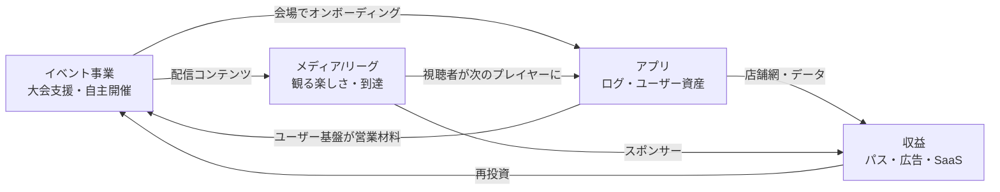

# NEST（旧称 TCG Advance）— 事業計画（v0.3.1）

> プロジェクト名は **NEST**（巣）に改名（オーナー決定 ✅ 2026-08-06。「tcg-advance」は長く話しづらいため）。
> リポジトリ名・アプリ内表記の切替タイミングは別途判断。本書では以降 NEST と表記する。

> v0.3: 「アプリ単体」から**TCG複合事業体**の計画へ拡張（オーナー決定）。
> チアード社の実物アセット（スタジオ・配信）を組み込み、イベント事業×アプリ×メディアの三層構造に再編。
> アプリのプロダクト要件は `12_user-journey.md` / `20_phase-a-requirements.md`、リテンション調査は `11_` を参照。
> ✅=決定・裏取り済み / 🔶=推奨案（オーナー判断待ち） / ⬜=未着手
> 最終更新: 2026-08-06（事業計画セッション）

## 変更履歴

| 版 | 日付 | 内容 |
| --- | --- | --- |
| v0.1 | 2026-07-31 | 00の論点8項目に対する初版。ショップSaaS先行案 |
| v0.2 | 2026-07-31 | SNS特化へ転換。思想（アンチオリパ）と対戦ログ中心に全面改訂 |
| v0.2.1 | 2026-07-31 | 大会連携をAPI連携優先へ。GTM（ショップ連携+大会協賛）確定 |
| v0.3 | 2026-08-06 | **複合事業体へ拡張**。チアード社アセット（スタジオ・配信）を計画に統合、収益ポートフォリオと成長ステージを再設計 |
| v0.3.1 | 2026-08-06 | **NESTに改名**。イベント事業の実数（スタジオ原価・配信レバレッジ）を反映、flipfreak封印提言を撤回、スポンサーアクティベーション予算戦略（年3,000万）を追加 |

---

## 1. 思想・メッセージ（オーナー決定 ✅）

### アンチオリパ — プレイされてこそのTCG

カードは単なる資産ではない。**「プレイするのが一番楽しい」**を体験で伝える。これがすべての事業の根。

### 対外メッセージ（v0.3で拡張）

> **僕たちはTCGがプレイされてほしいし、プレイを見るのも楽しい。
> だからそれを盛り上げることがしたくてこのプロダクトを作ったし、
> 僕らは体験をよりよくしていくことをお手伝いしたいです。**

「プレイする楽しさ」（対戦ログSNS）に「**観る楽しさ**」（配信・大会）が加わり、
事業ドメインは「TCGがプレイされる総量と質を上げること」に広がった。

### チアードの構図 — NESTとflipfreakは兄弟（オーナー決定 ✅）

- **flipfreak（FF）**: 「スポーツ観戦を楽しむ新しい選択肢を与えたい」が設計思想。すべてのスポーツを盛り上げる
- **NEST**: 同じ設計思想から、オーナーが一番好きなTCGを盛り上げる
- チアードという会社はこのためにある。個別に走っていたプロジェクトが1つの思想の下に**全部つながる**——観戦・参加の体験を盛り上げる複合事業体

## 2. 事業構造 — 三層の複合事業体（v0.3の核）

これはアプリ開発ではなく**TCG関連の複合事業体を作るプロジェクト**（オーナー定義 ✅）。

| 層 | 事業 | 役割 | 収益の時期 |
| --- | --- | --- | --- |
| **A. イベント事業** | スタジオ貸し（〜64人大会）/ 配信スタジオ貸し / 配信請負 / 大会自主開催 / 大会スポンサーメニュー | **今日から売れるB2B収益** ＋ 全案件がアプリの獲得現場になるCAC装置 | 即時 |
| **B. アプリ事業** | 対戦ログSNS（TCG Advance本体） | ユーザー・ログ・店舗網という**資産の蓄積層**。リテンションの背骨 | 後段（パス→SaaS） |
| **C. メディア/リーグ事業** | 大会配信コンテンツ、自主大会シリーズ→将来のプロリーグ | **到達とブランドの層**。ピラミッドの頂点を作る | 長期（スポンサー） |

### 会社アセット（チアード社 ✅）

- **貸しスタジオ**（https://studio.cheered.jp/ ）: 64人規模の大会まで自社開催可能
- **撮影機材と配信ノウハウ**: 各種TCG世界選手権等での配信プロデュース・ディレクション経験、機材一式
- 含意: イベント事業とリーグ事業の初期投資が**ほぼキャッシュアウトなし**で立ち上がる。個人開発アプリに世界選手権級の供給能力が接続される

### フライホイール

大会を支援するほどユーザーが貯まり、ユーザーが貯まるほど大会支援・協賛の営業力が上がり、
配信が「観る人」を「プレイする人」に変換する。どの層も他の二層を強化する。

## 3. 市場・競合（v0.2から継続 ✅）

- 国内TCG市場 2024年度 **3,024億円**・過去最高（[日本玩具協会統計](https://www.toys.or.jp/toukei_siryou_data.html)）
- 競合: 公式アプリ（BANDAI TCG+ / ポケカプレイヤーズクラブ / 遊戯王ニューロン）はタイトル縦割りの手続きツール、[Tonamel](https://www.kayac.com/service/gc)は主催者向け進行管理。**個人に対戦史が溜まるタイトル横断SNSは不在**（詳細はv0.1調査、`11_`）
- v0.3で加わる競合軸: イベント制作・配信会社。ただし「アプリ×会場×配信を一体提供できる事業者」は見当たらず、複合であること自体が参入障壁になる

## 4. アプリ事業（B層）— 対戦ログSNS（v0.2から継続 ✅）

- コア: **対戦ログ=二人の記録**が一生溜まる。相互確認・30秒入力・チェックイン自動付与
- リテンション: Steam型バッジ（実績→レベル→プロフィールレベル）、全国/エリア/ショップ3層ランキング（シーズン制）、非対戦日の週内サイクル設計（`12_` §1.5）
- イベント供給はGBPモデル（運営が集約掲載、店主は「ビジネスオーナーですか？」でclaim）
- 不正対策: ログ15分に1回・同一相手1日1回・本人認証（SMS/LINE）ゲート
- プラットフォーム: PWA→早期ネイティブ化想定
- 詳細は `20_phase-a-requirements.md`（実装要件）と `12_user-journey.md`

## 5. イベント事業（A層）— スポンサーメニュー（オーナー決定 ✅）

大会主催者（ショップ・自主大会・メーカー）に対する提供メニュー:

1. **大会スペース貸し**（自社スタジオ、〜64人）
2. **配信スタジオ貸し**
3. **配信業務の請負 / パートナースポンサーシップ**（プロデュース〜ディレクション〜実施）
4. **大会自主開催**
5. **プロリーグ運営**（→ §7、C層）

各メニューに共通する条件として「**大会でのNEST利用**」（チェックイン・ログ・限定バッジ）を組み込む。
= 受託案件がそのままユーザー獲得の現場になる（`12_` ジャーニー①の供給源）。

### 5.1 スタジオの経済性とTCG限定格安プラン（オーナー決定 ✅）

- 現状: 通常貸しは**8時間20万円**。スタジオの月間原価（固定費）は**約60万円**。現在月2.5件×20万程度で**ほぼトントン**
- 方針: **TCGイベント限定の格安プラン**を新設。稼働率は上がり利益率は下がるが、固定費はどのみち出ていくため、
  ①収支が安定する ②TCG業界でのプレゼンスが上がる、の2つが得られるなら追加キャッシュアウトなしで成立する（空き枠の限界費用はほぼゼロ）
- ⚠️ 設計時の注意: 通常単価20万の既存案件との共食いを避ける区分け（TCGイベント限定・対象枠の限定など）を料金設計に入れる
- ⬜ 格安プランの料金・提供条件の設計（オーナー）

### 5.2 配信の経済性 — 15万の原価で80万相当を提供する（オーナー決定 ✅）

- **オーナー自身は現場に入らない**。10年やってきたパートナー配信チームに委託（スタッフは原価で仕入れ可能）。ノウハウ・機材は自社
- 経済性: 1日の配信で**原価 約15万円 → 市場価値 約80万円相当**の提供が可能（約5倍のレバレッジ）
- 提供形態は2つ:
  1. **請負プラン**: 格安で受ける。うちはほとんど利益を取らない
  2. **パートナースポンサーシップ**: 技術提供という形の協賛。大型イベントなら一部費用持ち出しも許容
- 狙いは配信収益でなく、**§6.4のスポンサーアクティベーション**（NESTの露出・大会ログ・コンテンツ資産）
- 営業はオーナーの既存人脈・実績（世界選手権級の配信実績）から。アプリのユーザー基盤が育つほど「参加者にリーチできる」ことが営業材料に加わる

## 6. 収益ポートフォリオと順序（v0.3で再設計 🔶）

### 6.1 検討した選択肢とオーナー評価

| 収益源 | 評価 |
| --- | --- |
| リワード/リスティング系アプリ広告 | eCPM下落傾向。メイン収入としてPLを組まない（従とする） |
| flipfreak連携（大会での投票体験→FF送客） | §6.3参照。**思想同根の自社兄弟プロダクト**として推進（v0.3.1で方針転換） |
| TCGショップ純広告 | 柱にはならないが安定的。オンラインオリパの出稿は思想上受けない |
| ショップ向けCRM SaaS | ユーザーが溜まってから。claim済み店舗網が見込み客リスト |
| ユーザー課金（サブスク） | **月額パスが本命**（§6.2） |
| プロリーグ運営 | 収益化は大変だが、スタジオ+機材がキャッシュアウトなしという下駄がある（§7） |

### 6.2 段階別の収益計画（🔶 推奨）

| 段階 | 収益源 | 前提条件 |
| --- | --- | --- |
| **今すぐ** | イベント事業（スタジオ貸し・配信請負・協賛メニュー） | なし。ユーザー数非依存。**これがあるためアプリの収益化を焦る必要がない** |
| **ユーザー数千〜** | ショップ純広告（店舗ページ・イベントのfeatured枠などネイティブな形） | GTMエリアでの密度 |
| **同上** | **TCGショップ月額パス**: 加盟店で優待が受けられるユーザーサブスク | claim済み店舗網 × エリア内ユーザー密度。「アド取るの大好き」なTCGプレイヤーと相性最良（オーナー仮説）。ユーザー=課金理由/店舗=無料で送客/アプリ=非対戦日も「持ってるだけで得」という三方良し。**エリア密度が商品価値なので、GTMの地域集中がそのまま前提条件になる** |
| **スケール後** | ショップ向けCRM SaaS、リワード広告（従）、リーグスポンサー | ユーザーデータの母数、claim店舗の実績 |

### 6.3 flipfreak連携（v0.3.1で方針転換 ✅）

v0.3の「封印提言」は撤回する。前提が変わったため:

- FFは外部ベッティング事業者ではなく**チアードの自社プロダクト**。設計思想は「スポーツ観戦を楽しむ新しい選択肢」でギャンブル性が主体ではない（NESTと同一の設計思想）
- 法務判断はオーナー管掌（リリース前に最終法務レビューも実施）
- NEST×FFの**二重の網**でユーザーを獲得・回遊させる構造は、CACを掛け捨てにしない仕組みとして§6.4の中核

残る確認は1点のみ（🔶）: **メーカーの大会・配信ガイドラインとの整合**。タイトルによっては対戦結果への投票・予想系企画の扱いに制約がありうるため、§7の⬜（タイトル別ガイドライン整理）にFF連携の観点を含めて確認する。

### 6.4 スポンサーアクティベーション予算戦略（オーナー決定 ✅ / 運用は🔶）

**NEST+FF合算で年間約3,000万円**をマーケティング予算として投下できる。方針:

- **媒体に広告費として払わない**。全額を**自社制作のスポンサーアクティベーション費**（コンテンツ制作、スタジオでのイベント開催、配信つき大会支援）として投入する
- レバレッジの根拠:
  1. 配信は原価15万→80万相当（§5.2）と、自社アセット経由の投下は市場価格の数分の一で同等物を作れる
  2. 媒体費は流れて消えるが、アクティベーションは**資産が残る**（コンテンツライブラリ、コミュニティ、店舗網、大会ログ）
  3. FFとNESTの二重ファネルで、1つの施策が両プロダクトのユーザー獲得に効く（TCG大会の視聴者→FFの投票体験→NEST登録、の相互流入）
- 市場価格換算で1億円超相当の広告効果、というのがオーナーの見立て。方向性は妥当（上記1–3の積み上げで説明がつく）
- 🔶 セッション付言: **換算値は対外説明用にとどめ、内部管理は実測で行う**ことを推奨。施策ごとに「登録単価（実CAC）」「4週残存した人あたり単価」を記録し、換算広告効果ではなく実数でアクティベーションの費用対効果を検証する（→ KPI計測 `20_` §7 の流入元計測がこの前提）

## 7. メディア/リーグ事業（C層）（🔶 段階案）

「プロリーグを作る」と宣言せず、**既成事実の積み上げ**で立ち上げる:

1. 自社スタジオで自主大会を定期開催（月次〜。64人規模、全対戦がログに残る「認証済み大会」）。**プライズは近隣加盟店の利用券**（例: 優勝2万円分。原資はアクティベーション予算、法的整理もしやすい形 ✅）— 大会・パス加盟網・広告予算を1本の循環にする（詳細 `21_` §3.5）
2. 配信をつける（機材・ノウハウは自社。配信そのものがアプリの広告になる）
3. シーズン制・ポイントランキングを導入（アプリのシーズン機能と接続）→ 事実上のリーグ化
4. 視聴とスポンサーが積み上がった段階で「リーグ」として命名・営業

- 収益はスポンサー枠+配信案件。ただし当面は**A層・B層への波及効果（コンテンツ・獲得・ブランド）を主目的**とするコストセンターと割り切る
- ⚠️ メーカーの大会・配信ガイドラインの確認が前提（タイトルごとに公認/非公認大会の規模・賞金・配信の制約が異なる）→ ⬜ タイトル別に整理

## 8. 成長ステージ（🔶 推奨）

| ステージ | 状態 | 主な動き | 主要KPI |
| --- | --- | --- | --- |
| **Stage 0**（〜Phase Aリリース） | アプリ開発中 | イベント事業の営業開始（メニュー整備・案件獲得）。協賛大会・提携ショップの仕込み | 支援案件数、開発進捗 |
| **Stage 1**（初期1,000人） | GTMエリア+協賛大会で獲得 | 自主大会の定期化・配信開始。パスの構想を店舗網に予告 | **週次ログ数、4週残存**（PMF判定）、claim店舗数 |
| **Stage 2**（数千人・claim店舗20+） | エリア密度が成立 | **月額パス開始**（GTMエリア限定から）。ショップ純広告。CRM SaaSプリセールス | パス加入率、加盟店数、パス経由来店 |
| **Stage 3**（1万人〜） | 面の拡大 | 隣接エリア展開（イベント事業とセットで）。シーズンリーグの命名・スポンサー営業。CRM SaaS本実装 | MRR、リーグ視聴、SaaS契約 |

- 資金面: A層の受託収益が固定費（月1〜3万円+α）を大きく上回る想定のため、**外部調達なしで Stage 2 まで到達できる**のがこの構造の強み
- North Star は変わらず**週次の対戦ログ作成数**。複合事業体になっても「プレイされた総量」がすべての層の共通指標

## 9. リスク（v0.2から更新）

| リスク | 深刻度 | 対策 |
| --- | --- | --- |
| **オーナー時間の奪い合い**（受託は手離れが悪く、案件を取るほどアプリ開発が止まる） | **高→中**（配信はパートナーチームに委任・オーナーは現場に入らない方針で大幅緩和） | 残る自分ごとはスタジオ案件の窓口・営業・企画。ステージごとの時間配分ルールは引き続き設定推奨（⬜ オーナー） |
| メーカーIP・大会/配信ガイドライン | 高（C層の前提） | タイトル別に公認/非公認・賞金・配信の制約を整理（⬜）。メーカーとは対立でなく補完（プレイ人口を増やす側）のポジションを一貫させる |
| FF連携とメーカー規約の不整合（投票・予想系企画の扱い） | 中 | タイトル別ガイドライン確認（§6.3）。法務レビューはオーナー管掌で担保済み |
| スタジオ格安プランの共食い（通常20万案件の値崩れ） | 低〜中 | TCGイベント限定・対象枠限定で区分（§5.1） |
| ログの偽装・複垢 | 中 | レート制限+本人認証ゲート+チェックイン連動（`20_` §3.2） |
| 公式が同種機能を出す | 高 | 横断×公式の外側×個人アーカイブ+**実会場アセット**に軸足（アプリ単体より模倣困難になった） |
| 個人開発の継続性 | 高 | 意思決定を 10_/1x_/2x_ に残す運用を継続 |
| ログの永続性への信頼 | 中 | データエクスポート提供（`20_` §3.6） |

## 10. 決定事項と次のアクション

### 決定済み（オーナー ✅）

- プロジェクト名を **NEST** に改名（リポ名・アプリ内表記の切替は別途）
- 本プロジェクトは**TCG複合事業体**（イベント×アプリ×メディアの三層）。FF（flipfreak）と同一設計思想の兄弟プロダクトとしてチアードの下で統合
- スタジオ: TCGイベント限定の格安プランを新設（固定費60万/月は既支出、空き枠の限界費用ほぼゼロ）
- 配信: オーナーは現場に入らずパートナーチームへ委託。請負プラン+パートナースポンサーシップの2形態（原価15万→80万相当/日）
- マーケ予算: NEST+FF合算 年約3,000万円を媒体費でなく自社スポンサーアクティベーションに全投入
- FF連携は推進（法務はオーナー管掌）
- 対外メッセージ: 「プレイされてほしい、観るのも楽しい、体験をよくするお手伝いをしたい」
- スポンサーメニュー5点（スペース貸し/配信スタジオ/配信請負/自主開催/リーグ運営）を大会に提供し、その場でアプリを使ってもらいユーザーを貯める
- リワード広告はメイン収入にしない。オンラインオリパの出稿は受けない
- （v0.2から継続）対戦ログSNS・GBPモデル・Steam型バッジ・3層ランキング・本人認証ゲート・早期ネイティブ化

### オーナー判断待ち（🔶）

1. 収益の段階計画（§6.2）の承認
2. リーグの段階的立ち上げ案（§7）の承認
3. Stage 0の時間配分ルール（アプリ:イベント比率）
4. バッジ初期ラインナップ（`20_` §5.2、継続）
5. アクティベーションの内部評価を実CAC（登録単価・残存単価）で行う運用（§6.4付言）の採否

### 次のアクション（⬜）

1. スポンサーメニューの価格表・提供条件整備（スタジオ格安プラン含む。オーナー）
2. タイトル別のメーカー大会・配信ガイドライン整理（**FF連携=投票・予想系企画の扱いを含む**）
3. ✅ 月額パスの事業設計を `21_shop-pass.md` として起案（2026-08-06。価格・優待メニュー・景表法観点はオーナー判断待ち）
4. FF×NESTの相互送客の企画設計（大会での投票体験の中身。FF側リポとの突き合わせは別セッションで）
5. Phase A実装着手（`20_` を開発セッションへ。PR #2 マージ後）
6. KPIベースライン取得クエリ整備（継続）
7. NEST改名の実務（リポ名/アプリ表記/ドメインの切替計画）
