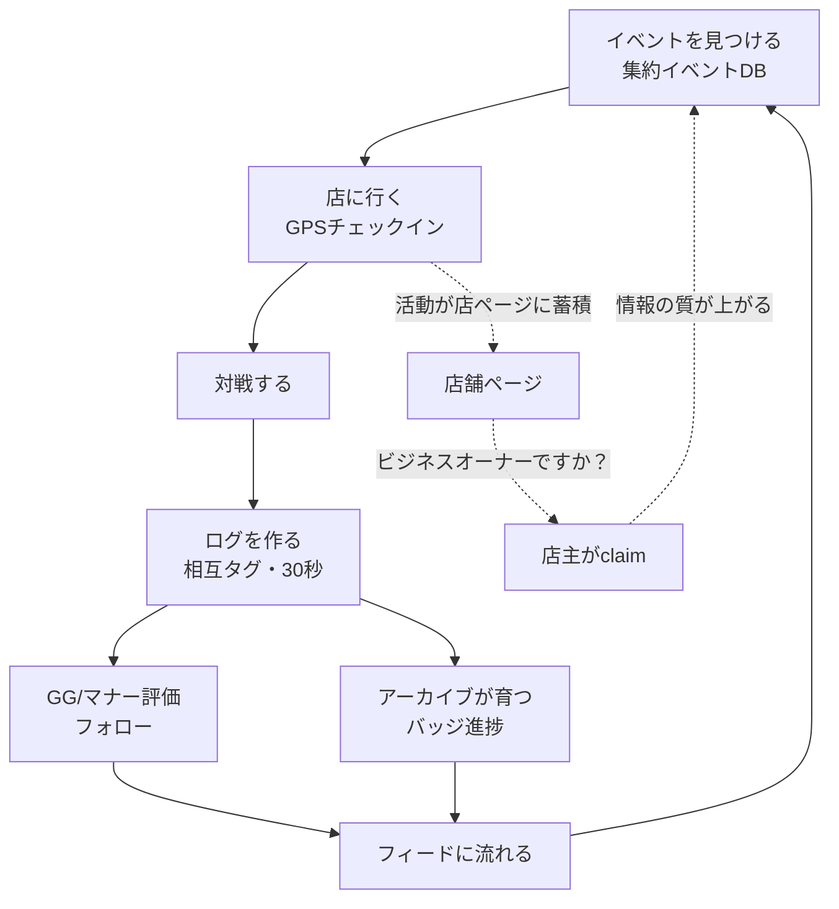

# ユーザージャーニー / エコサイクル設計

> Phase A実装前の必須設計（オーナー指摘: ログ単体では体験が薄く、部品リスト(`20_`)だけでは実装に進めない）。
> 3人の主役の動線を時間軸で描き、各ステップで「アプリが何を見せ、何が次の行動を引き起こすか」を固定する。
> ここから浮かんだ部品の過不足は `20_phase-a-requirements.md` に反映済み。
> 最終更新: 2026-07-31（事業計画セッション）

## 0. 前提となる構造判断（オーナー決定 ✅）

**イベント情報はショップに載せさせない。運営が集めて載せる（GBPモデル）。**

- 初期のイベント・店舗情報は、ショップのサイト・X告知などから運営がスクレイピング/キュレーションして掲載
- 店舗ページには「ビジネスオーナーですか？」導線だけ置き、店主が現れたらclaim（無料）で編集権を渡す
- ショップ向けの投稿・管理機能はclaim済み店主が増えてから（＝将来のショップSaaSの入口。Phase C/D）
- 効果: プレイヤーは初日から「地元のイベントが載っている」状態で使い始められる。供給側の鶏卵問題が営業タスクでなく運用タスクになる
- 運用上の割り切り: 全国はやらない。**GTM対象エリア＋協賛大会の商圏だけ**を人力込みでカバーする（地域集中戦略と整合）

## 1. エコサイクル全体図

内側のループ（A→G）がプレイヤーの週次サイクル。外側（H→I）が店舗情報の質が勝手に上がっていく供給サイクル。

## 1.5 週内サイクル — 「対戦しない日に開く気になるか？」（オーナー指摘）

対戦日（週末・大会日）のループだけでは、平日にアプリが死ぬ。バッジ・ランキングを軸に、
週の各タイミングに「開く理由」を配置する:

| タイミング | 開く理由 | 使う部品 |
| --- | --- | --- |
| 対戦翌日（月） | 週末の余韻: GG・相互確認の通知、フィードに仲間の週末ログ、**週間ランキング確定**（「今週の○○店 常連番付 3位」） | フィード / ランキング |
| 週中（水） | **バッジ進捗**（「あと2戦で50戦」のプログレスバー）、抜かれたランキングの確認 | バッジ / ランキング |
| 週末前（金） | 次の行き先探し: 近くのイベント、**「行く」ブックマーク**（未来の意図の置き場=Letterboxdのウォッチリスト相当）、フォロー中の人の「行く」表明 | 集約イベントDB |
| 月末 | **月間サマリー**とシーズンランキング確定、シーズン称号の付与 | アーカイブ / ランキング |

- 原則: どの再訪理由も「次の対戦・来店」に接続する（開かせること自体が目的化しない。思想は「プレイが一番楽しい」）
- ⚠️ 制約: 非対戦日の再訪はアプリ内通知だけでは弱い。**Web Push（PWA対応）の優先度を上げる判断が必要**（→ `20_` §9 オープン論点）

## 2. ジャーニー① 協賛大会で入れた人（初期1,000人の主体）

ペルソナ: 地方在住のポケカプレイヤー。月1〜2回大会に出る。戦績はスプシ管理。

| 時点 | 行動 | アプリが見せるもの / 起きること | 設計上の要点 |
| --- | --- | --- | --- |
| Day 0 大会当日 | 対戦後に相手から「ログ作りませんか？」/ 協賛ブースで案内 | 招待コード付きオンボーディング → その場で初ログ（相手タグ・勝敗） | 初回起動→初ログを1分以内に。**初ログで即バッジ付与**（薄さを最初の10分で補う） |
| Day 0 夜 | ホテル/帰路でアプリを開く | 今日の対戦ログ一覧、タグした相手のプロフィール、GG通知 | 「今日の記録が既に資産になってる」感。相手をフォローする導線 |
| Day 1–3 帰宅後 | なんとなく開く | **「あなたの地元のイベント」**— 集約DBから近所の店の大会が既に載っている | ここが生死の分かれ目。地元イベントが0件なら離脱。協賛大会の商圏は事前に集約カバーしておく（§0） |
| Week 1–2 | 地元の店の大会に初参加 | チェックイン→対戦→ログ2件目以降。「同じ店に通う」系バッジの進捗が見える | 大会で会った遠方の相手のログがフィードに流れる=「向こうも続けてる」 |
| Month 1 | 週次ループに入るか離脱するか | 累計10戦・相手5人などの節目バッジ。月間サマリー | **4週残存の判定点**（PMF指標） |
| Month 3+ | 次の大型大会 | 「前回大会で対戦した人」との再戦・再会 | 原体験（`10_` §1）の初回発火。ここまで残った人は抜けない |

## 3. ジャーニー② 地元ショップの常連（連携ショップ経由）

ペルソナ: 週1で近所の店の大会に出る。店の常連コミュニティが生活の一部。

| 時点 | 行動 | アプリが見せるもの / 起きること | 設計上の要点 |
| --- | --- | --- | --- |
| 初回 | 店内で常連仲間か店主に勧められる | その場でインストール→今日の対戦をログ | 勧める側にインセンティブ（紹介バッジ）。店頭POP・QR |
| 毎週 | 店の大会に参加 | チェックイン→対戦2〜3件→ログ→GG。バッジ進捗（○○店の常連、対戦相手N人） | 週次の習慣は店の大会リズムが作ってくれる。アプリは記録と称号で並走するだけ |
| 月次 | 振り返り | 月間サマリー（何戦・何人・何勝）。フィードで仲間の活動 | プレミアム（Phase D）の原型になる画面 |
| 継続 | 他店・他タイトルへ | 「3タイトル制覇」「5店舗訪問」系バッジが越境を促す | アンチオリパ思想の体現: 深く・広くプレイすることが称えられる |

## 4. ジャーニー③ ショップ店主（受動 → claim）

ペルソナ: 個人経営のカードショップ。SNS発信は苦手。大会は毎週やっている。

| 時点 | 行動 | 起きること | 設計上の要点 |
| --- | --- | --- | --- |
| Phase A開始時 | **何もしない** | 運営が店舗ページとイベントを集約掲載済み | 店主の作業ゼロで店がアプリ上に存在する |
| 数週間後 | 常連から「アプリに店出てますよ」と聞く / チェックインが増える | 店舗ページに来店・対戦の活動が蓄積して見える | 店ページ＝「うちの店でこんなに遊ばれてる」の可視化 |
| 関心を持ったら | 「ビジネスオーナーですか？」からclaim | 店舗情報の編集権、イベント情報の直接更新 | 無料。本人確認は軽く（電話/店頭確認など運用で） |
| Phase C/D | claim済み店主にショップ向け機能を提案 | 大会運営連携・常連分析・SaaS | claimリストがそのままSaaS見込み客リストになる |

## 5. ジャーニーから確定した部品の増減（`20_` v0.2に反映）

### 増（Inに移動・追加）

1. **バッジ初期セット**（Phase B→A）: 体験の薄さを初日から補う即効層。初期セットは「プレイ量・相手の多様性・通った場所」を称える設計（勝敗系は入れない=アンチオリパ思想）🔶 具体ラインナップはオーナー確認
2. **集約イベントDB＋店舗ページ＋claim導線**: ジャーニー①③の背骨。アプリ機能としては「表示」だけ。収集はオペレーション
3. **紹介・招待の計測**（誰経由で入ったか）: ジャーニー②の勧める側インセンティブとGTM計測を兼ねる

### 減（Outを確認・明確化）

1. ショップ向けイベント投稿・管理画面（claim後の最小編集のみ。本格機能はPhase C/D）
2. プレイヤー同士のマッチング機能（「地元の環境」はイベントが載っていることで担保する。相手探しはやらない）
3. デッキ機能全般（メーカー公式デッキビルダーのスクショを**画像1枚添付**できれば十分。自前カードDBなし=IPリスクなし）

### 運用タスク（アプリ外・オーナー/運営）

- GTMエリア＋協賛大会商圏のイベント情報収集パイプライン（スクレイピング＋人力キュレーション）
- 出典明記・掲載ポリシー・店舗からの修正/削除依頼への対応フロー（店に歓迎される掲載の仕方にする）

## 6. 残る確認事項

- 🔶 バッジ初期セットの承認（§5-増-1の方向性で具体案を作る）
- ⬜ イベント収集の情報源リストと収集頻度（GTMエリア決定後）
