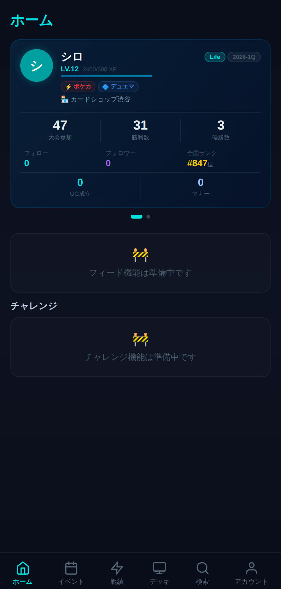
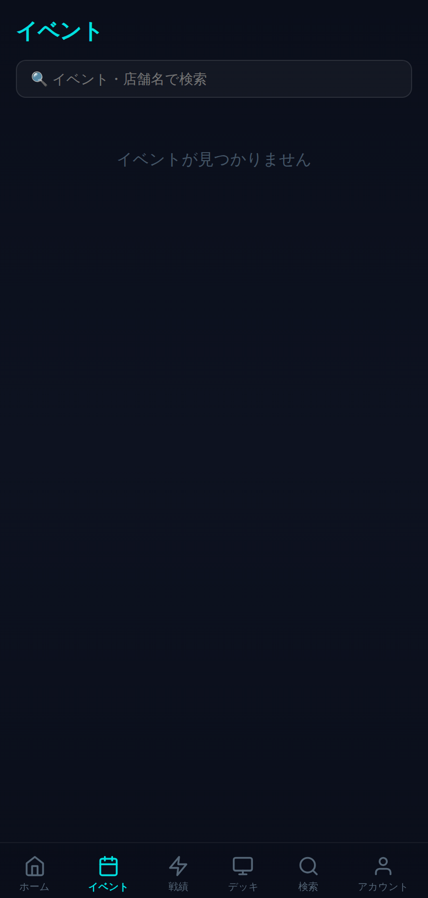
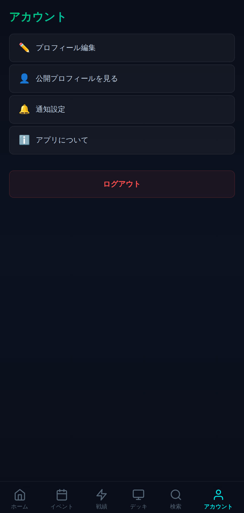
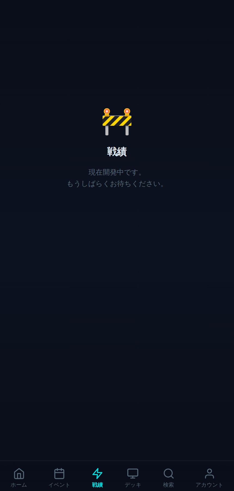
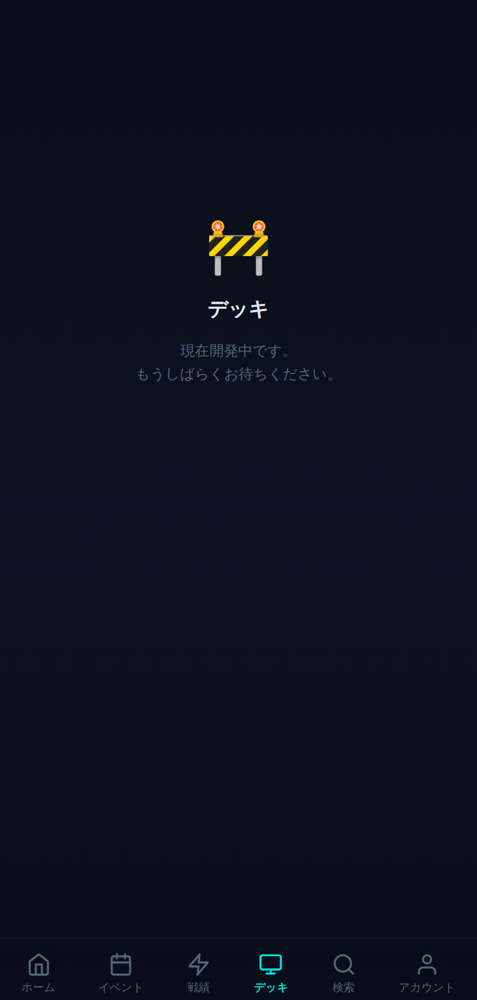
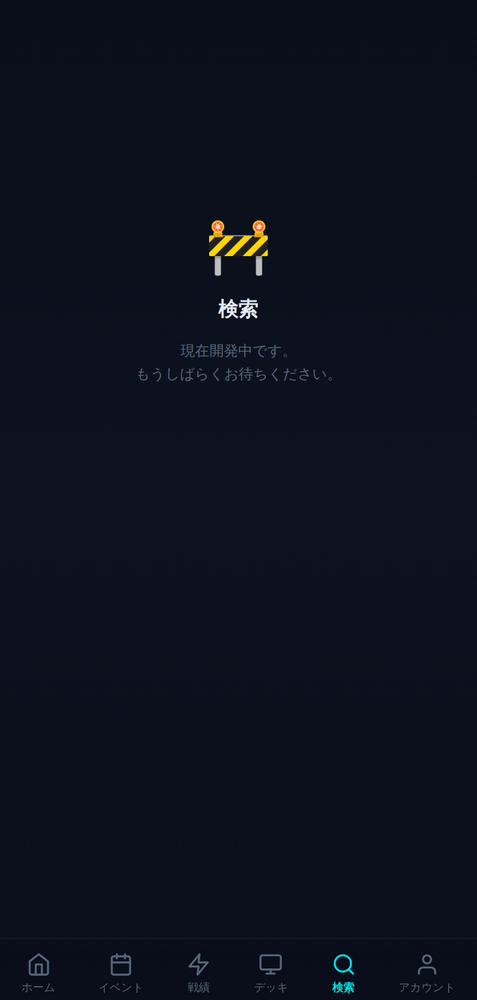

# 📱 リンク集（スマホ用ブックマーク）

モック確認・開発でよく使うリンクのまとめ。このページをスマホでブックマークしておく想定。

## デプロイ済みモック

| アプリ | URL | メモ |
| --- | --- | --- |
| TCG Advance 本体 | https://tcg-advance.vercel.app | Vercel。実Supabase接続（要ログイン） |
| Tournament Organizer | （URL未記録 — Vercelダッシュボードで確認して追記） | `tournament-organizer/` の共有ハブモック |

## 管理画面

- Vercel ダッシュボード: https://vercel.com/dashboard
- Supabase ダッシュボード: https://supabase.com/dashboard/project/lowyifjtngxhftnptlzk

## GitHub

- リポジトリ: https://github.com/morio2001/tcg-advance
- ブランチ一覧: https://github.com/morio2001/tcg-advance/branches
- このリンク集・スタイルガイド: [`design/`](./)

## 現状の画面（`npm run shots` で更新）

| ホーム | イベント | アカウント |
| --- | --- | --- |
|  |  |  |

| 戦績 🚧 | デッキ 🚧 | 検索 🚧 |
| --- | --- | --- |
|  |  |  |

## 開発コマンド

```bash
npm run dev:mock   # Supabaseなしで全画面確認（モックログイン済み）
npm run shots      # 全タブのスクショを design/screenshots/ に書き出し
npm run dev        # 通常起動（要 .env.local の Supabase 環境変数）
```

トンマナは [`styleguide.md`](./styleguide.md) を参照。
